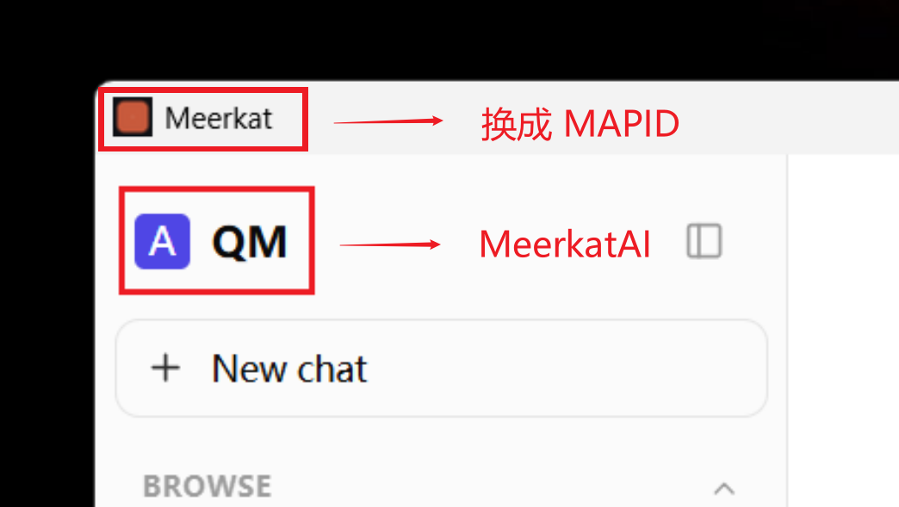

# 需求描述

## 🌈 需求

### 1. sub-agent 机制

调研结论：pi 官方无内置子代理能力；第三方 [pi-subagents](https://github.com/nicobailon/pi-subagents) 因 qm 关闭了 pi 扩展机制（`noExtensions:true`）且 core 为定制安全构建 + bundle 打包形态，无法直接引入，仅作设计参考。

需求：参考 pi-subagents 的设计，自研桌面版 sub-agent 机制（任务派发、独立上下文、结果回收）。

### 2. UI 界面与 i18n 国际化

1. 翻译：进行 i18n 国际化的翻译，将界面的英文转换成简体中文，且默认就是中文。
2. UI：部分字要换掉，比如产品左上角的 QM 换成 MeerkatAI，原来的 Meerkat 换成 MAPID，如图 
3. UI：desktop 产品图标需要更换，图标见 

### 3. 接入 MCP Server 服务

```javascript
{
  "mcpServers": {
    "lawaken-memory-dev": {
      "url": "https://dev.lawaken.com/api/memory/mcp",
      "headers": {
        "X-Lawaken-MCP-Key": "lawk_mcp_41a5ed04c11005a8_K9cR2EfwJGmBEN554j5IokNdKiFMhh3G2iyNUZp94-4"
      }
    }
  }
}
```

### 4. 技能页本地上传入口（md / zip）

使用中发现的缺口（详见 issue #17）：桌面端缺少「现用现装」的技能注册入口——会话内上传 skill 文件或给 git 仓库地址都只会把文件落到 workspace，不会进入技能注册表，侧栏技能列表和 `/` 补全都看不到。

需求：在 Skills 页右上角新增「本地上传」按钮，支持两类文件：

1. **md 文档**：单个或批量上传含 frontmatter 的 SKILL.md，解析后逐条注册；
2. **.zip 压缩包**：内部为批量 skill 目录（每个目录一个 SKILL.md + 配套资产文件），客户端解压校验、预览确认后批量注册，资产文件随包保留。

期望效果：上传后能在侧栏技能列表看到、能用 `/<skill-name>` 调用；上传结果要有明确的成功/失败反馈。

关联：issue #17 修复方向 B 的具体化。「从 git 仓库导入」按钮为同位需求，本期缓做——git 仓库可随包内置分发，而现用现装只有上传是最快路径。

### 5. 会话产出文件兜底可见

使用中发现的缺口（详见 issue #24）：agent 在会话中生成的文件（如 PPT）只写进沙箱 workspace、未走 `$AGENT_OUTBOX` / `post(files)` 交付通道时，「文件」面板（artifact 注册表）中不可见、无下载入口；本地模型不遵循交付指引，还会幻觉「复制到 workspace 就能在文件面板看到」，误导用户。

需求：DM turn 结束时兜底检测本轮 workspace 新建/修改但未交付的文件，自动登记为 artifact 并归属当前用户，使会话产出必然在「文件」面板可见、可下载。

期望效果：用户让 agent 生成任何文件后，不依赖 agent 自觉交付，都能在「文件」面板找到并下载；已显式交付的文件不重复登记；中间产物（node_modules、缓存等）不造成明显噪音。

关联：issue #24（修复方向 B）。涉及 core turn 收口与 artifact 注册，须记 ADR。

## 🚀 优化

### 1. Skill name 中文校验

在使用 `New skill` 功能创建新的 skill 时，skill 的 name 不能是中文，否则会出现 `internal server error` 的问题，所以需要在输入 name 时进行格式的校验，并给出提示。

`name` 的规则如下：

1. `name` 必须是 ASCII 码；
2. 1-64 字符、仅小写字母、数字、连字符；
3. 不能以连字符开头/结尾；不能连续连字符；

表单联动效果：

1. Name、Description、Instructions 三个表单项必填。
2. `Create skill` 按钮需要添加禁用效果，在表单校验不同的情况下，按钮不可点击。

注：core 服务端实际校验规则更宽松（1-128 位、允许大写字母/点/下划线），UI 按上述严格规则（对齐 Claude Skill 规范）提前拦截即可；服务端侧的 500 报错改 400 + 人话文案，归 issue #7 处理。

### 2. 设置页目前不可回访，需要添加入口

配置完成后设置页没有任何回访入口：想改代理、API key 等配置只能重走首次启动流程，且重新保存需重填令牌；卸载重装也不解决。

需求：主界面增加设置入口，可查看/修改已有配置（令牌等敏感字段脱敏显示，留空表示不修改）。

## 🐞 Bug

### skill pack 首启裸连 GitHub 必失败——快照随包内置，GitHub 降级为更新通道

问题地址：👉️ <https://github.com/MeerkatAIChina/meerkatai-agent/issues/6>

---

## 需求六：桌面端文件 Artifact 持久化（SQLite）

### 背景

桌面版 Meerkat 在 v0.1.4-alpha 实测中出现：会话中生成的文件在聊天里能看到附件芯片，但**重启应用后「文件」面板为空**。筛选条件为「全部文件 / 全部类型 / 最新」，无 scope 限制。

该问题已记录为 GitHub issue #34。

### 问题

桌面版启动 core 时没有配置持久化的 `fileArtifactStore`，`src/wiring.ts:586` 在没有 `DATABASE_URL` 时回退到 `createMemoryFileArtifactStore`，导致文件 artifact 元数据只保存在 core 进程内存中，core 重启即丢失。

### 影响

- 用户无法在「文件」面板查看历史生成的文件。
- 已存在的聊天附件芯片仍可显示（因为消息历史本身存在），但对应的 artifact 元数据/字节可能已经丢失，点击后可能无法下载。
- 与 qm 的连续性：这是一个 Meerkat 桌面版独有的部署配置问题，core 的 store 接口本身支持持久化，只是桌面版没有传入合适的后端。

### 目标

让桌面版在本地持久化保存文件 artifact 元数据，使得：

1. 重启 Meerkat 后，「文件」面板仍能列出之前生成的文件。
2. 不引入外部依赖（如 Postgres），保持桌面版单用户、离线可用。
3. 改动尽量局限于 Meerkat 层；若必须改动 core，则记录 ADR。

### 验收标准

- [x] 在桌面版生成文件后重启应用，「文件」面板仍能看到该文件。
- [x] 重启后点击聊天历史里的附件芯片，仍能正常导出/打开文件。
- [x] 单元测试覆盖新的 SQLite file artifact store 的核心行为（put/get/list/open）。
- [x] 不破坏现有 postgres/memory 实现及其测试。
- [x] ADR 记录为何选择 SQLite 以及 schema 设计。

### 范围

- 新增 `src/files/sqlite-file-artifact-store.ts`。
- 调整 `src/wiring.ts` 让 `fileArtifactStore` 在 `DATABASE_URL` 缺失但能识别到 SQLite 配置时使用 SQLite 实现。
- 调整 `deploy/layers/meerkat/desktop/src-tauri/src/proc.rs`，让桌面版 core 启动时携带 SQLite 数据库路径。
- 更新相关测试。

### 排除

- 不改动 `durable-byte-store` 的字节存储位置；文件字节继续走现有本地文件存储。
- 不迁移已有内存数据（首次升级后历史文件仍会丢失，属已知限制）。
- 不解决技能包无法访问 GitHub 的问题（与本次需求无关）。
